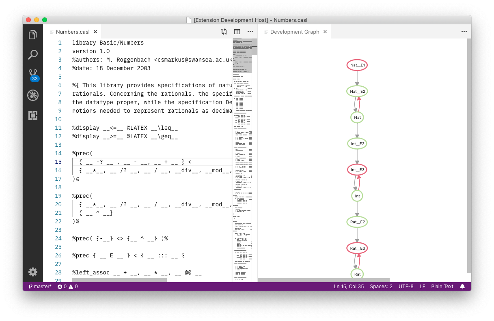

# Hets IDE

Hets IDE is an extension for the [Visual Studio Code](https://code.visualstudio.com/) editor.
It can display the development graph of an opened specification inside the editor and does this by integrating with the [The Heterogeneous Tool Set (Hets)](http://hets.eu/).
Download it from [the Visual Studio Marketplace](https://marketplace.visualstudio.com/items?itemName=spechub.hets-ide)!

## Features

Display a development graph inside of Visual Studio Code and communicate with configured provers.

## Requirements

Currently the extension requires a Hets server running on localhost port 8000 with the working directory on `/data`.
The easiest way to achieve this is by using the Hets Docker container as described in [the Hets wiki](https://github.com/spechub/Hets/wiki/How-to-use-the-Hets-Docker-Container#1-hets-standalone-container).

## Usage

Open a specification file that is supported by Hets and run the command: `Hets IDE: Load development graph for File` (keyboard shortcut `ctrl + alt + g`).  
The command palette can be opened with `cmd/ctrl + shift + p`.  
A new pane will open showing the development graph of the selected file.

To prove a node, simply select a node in the visible graph (the name will be shown on right side of the status bar) and run the command `Hets IDE: Prove selected Node` (keyboard shortcut `ctrl + alt + p`).    
The extension will fetch all available provers which can take a while, a progress indicator is shown on the left side of the status bar. After selecting a prover from the list a new progress indicator is shown while Hets is communicating with the prover. The result is shown in an output panel that will automatically open after the prover finishes.

## Extension Settings

It's possible to configure the hostname and port for the Hets server. The default values are `localhost` for the hostname and `8000` for the port.
The timeout (in seconds) for the prover can also be set, default are 5 seconds. **Not all provers support this setting!**

## Release Notes

### 0.0.5

* Improve syntax highlighting
* Highlight `.casl` and `.het` files
* Add default shortcuts to "show graph" and "prove" commands

### 0.0.4

* Add basic syntax highlighting for `.dol` files

### 0.0.3

* Highlight the selected node in the graph
* Support files in subfolders

### 0.0.2

* Add settings to configure Hets commands.
* Add loading indicator when fetching development graph.

### 0.0.1

* Initial release.
* Display the development graph for a selected document.
* Prove a selected node.

## Development

To create a local development setup clone this repository and run `npm install`.
The extension consists of two parts. Firstly the extension that will be loaded in VSCode is located under `./src/`. Secondly the React application loaded inside a Webview is located under `/webview/`.
To build both parts simply run `npm run compile`.
There is a run configuration provided to start a new VSCode instance in development mode, simply press `F5` or "Debug > Run Extension".
